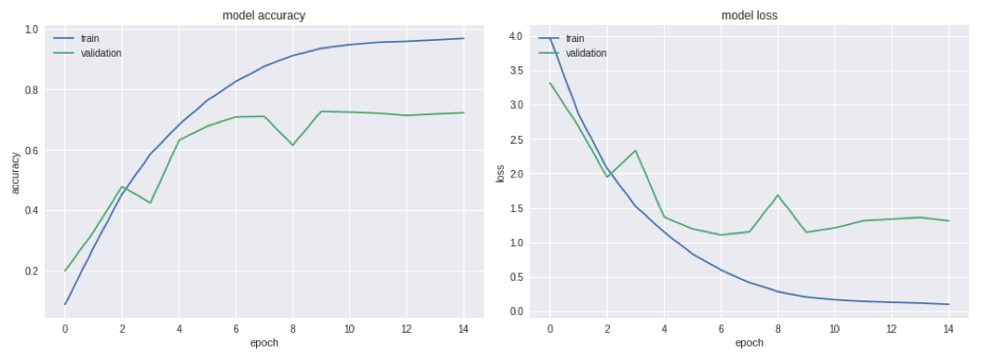
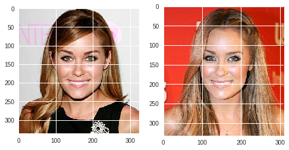

# Facial Recognition using CNN's

## Introduction

In this activity we will train an evaluate a classifier to detect 100 different faces, using a reduced version of the *vgg faces dataset* (~883 MB).
In the code we use AlexNet as the main model, but it could easily be changed to other models (for example using VGG-16, ResNet50, or simply defining your own model).

## Requirements

- Python 3.x
- Tensorflow
- Keras
- OpenCV
- The dataset available [here](https://www.dropbox.com/s/z9ryzz4ka04d0p7/vggface2_dataset100.zip)
- Matplotlib

## Using other models

If you want to change the AlexNet model, in the section *Building AlexNet model*, you can put your own model.

If you want to use VGG-16:

```
from keras.applications.vgg16 import VGG16

model = VGG16(include_top=True, weights=None, input_tensor=None,
        input_shape=None, pooling=None, classes=num_classes)
```

If you want to use ResNet-50:

```
from keras.applications.resnet50 import ResNet50

model = ResNet50(include_top=True, weights=None, input_tensor=None,
        input_shape=None, pooling=None, classes=num_classes)
```

## Results

The final configuration for testing was:

* Model: AlexNet
* Optimizer: Adam
* Learning rate: 0.0001
* Batch size: 128
* Epochs: 7

The final accuracy in the Test Set was: 70%

(Consider that the dataset is very diverse and noisy also. Several people corresponding to one of the 100 classes, contain photos that do not correspond to their person.)

Below is shown the accuracy and loss evolution in validation and training set:




For example, the best evaluated class was 'Lauren_Conrad' with 97% of accuracy.



This is because in the dataset the images of this person are very similar.

## Memory problems

If you have any issues with collpasing the memory because of the ammount of loaded data, you could use a DataGenerator instead:

```
from keras.preprocessing.image import ImageDataGenerator

train_datagen = ImageDataGenerator()
val_datagen = ImageDataGenerator()
test_datagen = ImageDataGenerator()

batch_size, epochs = 128, 8

train_generator = train_datagen.flow_from_directory(
        'vggface2_dataset100/train',
        target_size=(224, 224),
        batch_size=batch_size)

val_generator = val_datagen.flow_from_directory(
        'vggface2_dataset100/val',
        target_size=(224, 224),
        batch_size=batch_size)

test_generator = test_datagen.flow_from_directory(
        'vggface2_dataset100/test',
        target_size=(224, 224),
        batch_size=batch_size)
```

Then, for fitting the model:

```
history=model.fit_generator(
        train_generator,
        steps_per_epoch=train_size//batch_size,
        epochs=epochs,
        validation_data=val_generator)
```
